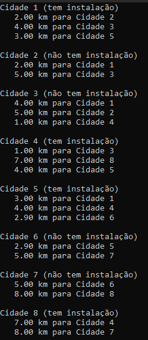
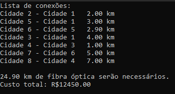

# Fibra Óptica

**Número da Lista**: 2<br>
**Conteúdo da Disciplina**: Grafos 2<br>

## Alunos
|Matrícula | Aluno |
| -- | -- |
| 18/0114077 | Lucas Rodrigues Fonseca |
| 18/0113861 | Kleidson Alves Corrêa |

## Sobre 
O projeto serve como assistência para encontrar a forma mais barata de se fazer uma instalação de rede de fibra óptica em um conjunto de cidades. Além de ser possível verificar a forma mais barata de instalação passando por todas as cidades, também é possível verificar a forma mais barata de instalar em uma cidade específica. Para a implementação dessas funcionalidades foram utilizados, respectivamente, os algoritmos de Prim e Dijkstra.

## Screenshots




## Instalação 
**Linguagem**: C++<br>

### Comandos para instalar dependências:
```
sudo apt install git
sudo apt install make
sudo apt install g++
```

### Instruções para executar:
```
git clone https://github.com/projeto-de-algoritmos/Grafos2_Fibra-Optica
cd Grafos2_Fibra-Optica
make
make run
```

## Uso 

### Gerenciamento de cidades
- Cadastrar cidade: Devem ser informados um nome ainda não utilizado e se a cidade já possui instalação de fibra óptica para cadastrar uma nova cidade
- Conectar cidades: Serve para indicar que a partir de uma cidade é possível chegar até outra, informando o nome de cada uma e a distância em km entre essas duas cidades.
- Desconectar cidades: Serve para remover uma conexão feita anteriormente, caso tenha sido feita por engano.
- Ver cidades: Lista todas as cidades cadastradas, seu status de instalação e suas cidades vizinhas.
- Alterar status de instalação: Possibilita a mudança de estado de instalação em uma determinada cidade para instalado ou não instalado.
- Deletar todas as cidades: Apaga todas as cidades e suas conexões.

### Menu de análise
- Calcular custo total para instalação: Informa qual é a forma mais barata de instalação passando por todas as cidades, informando as conexões que devem ser feitas, a distância percorrida em cada uma dessas conexões, a distância total percorrida e o preço em reais necessário para essa instalação.
- Calcular custo para uma instalação: Informa qual a cidade mais próxima que possui instalação de uma cidade informada, a distância a ser percorrida até ela e o preço em reais da instalação. A cidade informada não pode ter instalação.
- Alterar custo da fibra óptica: Permite alterar o preço em reais do km da fibra óptica.

## Outros 
O vídeo de explicação do programa se encontra na pasta raíz do repositório.
